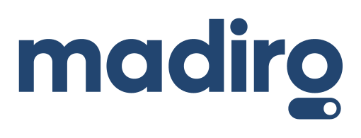

[](https://github.com/MSF-OCG/LIME-EMR-project-demo/actions/workflows/build-backend.yml)
[](https://github.com/MSF-OCG/LIME-EMR-project-demo/actions/workflows/build-frontend.yml)


# MSF-OCG LIME EMR Project - OpenMRS 3.x demo

<div>



</div>

## A Generic Light Modular EMR using

<div>

</div>

## Integration with

<div>
<td></td>
<td>&nbsp;&nbsp;&nbsp;&nbsp;&nbsp;&nbsp;&nbsp;&nbsp;</td>
<td>&nbsp;&nbsp;&nbsp;&nbsp;&nbsp;&nbsp;&nbsp;&nbsp;</td>
<td>&nbsp;&nbsp;&nbsp;&nbsp;&nbsp;&nbsp;&nbsp;&nbsp;</td>
</div>

## Technical documentation of the project
[https://msf-ocg.github.io/LIME-EMR-project-demo](https://msf-ocg.github.io/LIME-EMR-project-demo)

## Quick start

### Package the distribution and prepare the run
```
docker compose build
```
### Run the app

```
docker compose up
```

## Ambitions and success criteria

- Integrated – with OpenMRS ecosystem and community roadmap
- Innovative – leveraging modern technology and approaches
- Sustainable – using well maintained and documented tools and practices
- Open – using open-source software and licenses allowing for reusability
- Data driven – quality information will be available to the right people when they need it
- Quality of care – address tangible needs from health care workers and patients
- Relevant – content and patient flows representative of use cases defined healthcare workers
- Harmonized – content is following global standards such as ICD, SNOMED, etc.
- Portable – agnostic architecture, containerization, and orchestration
- Adaptable – content and configuration management that can easily be updated
- Recoverable – recommendations for a solid backup and recovery strategy
- Testable – automated testing and reporting whenever possible
- Secure – architecture and practices to meet GDPR and HIPAA regulations
- Reliable – recommendations to support redundancy, failover, and monitoring by design
- Interoperable – to support Health Information Exchange (HIE) and standards such as HL7 FHIR
- Collaborative – share information, insights, strategies and deliverables within the community
- Achievable – taking in account the overall roadmap and challenges of implementers
