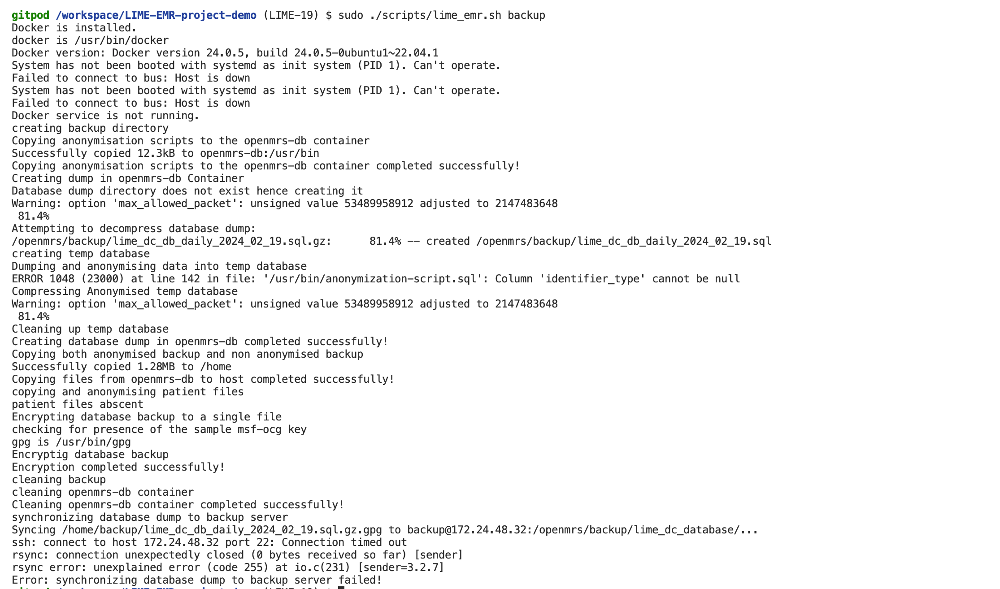

# [Database and Patient File Backup Testing Documentation](#backup-testing)

This documentation provides instructions for testing the backup functionality of the database and patient files in the `lime_emr.sh` script.

## **Introduction**

The backup functionality in the script is designed to create backups of the database and patient files, anonymize sensitive data, encrypt the backups, and synchronize them to a remote(another) backup server ie <backup@172.24.48.32>

## **Testing Procedure**

Run Backup Command: Execute the following command to initiate the backup process: 
**NOTE: server must be running already**

  

## **Verification Steps:**

- **Database and Patient File Backup:**
  - Check if the script successfully creates either 2 or 6 backup files of the database and patient files if present like in sample below
    

    
    

  - Verify that the backup files are compressed and saved in the ***/home/backup*** directory.
  - Ensure that the database dump includes all necessary data.
  - Confirm that the anonymization process is applied to sensitive data in the database dump.
    - unzip the ***anonymized\_lime\_dc\_db\_daily….sql.gz***  in the ***.sql*** file check that person.names table has randomized anonymous names 
    - unzip the ***anonymized\_patient\_files\_lime\_dc\_db\_daily….tar.gz***  in the created ***complex-obs*** folder check that images or sensitive documents have been replaced with a simple text file but with the same names as the initial patient files 

- **Encryption:**
  - Sample msf key <.msf.ocg@example.com> is created if is already doesn't exist.  Also creating this key is non-interactive
  - All backup files are encrypted using GPG. and have a ***.gpg*** extension

- **Synchronization:**
  - Confirm that the encrypted backup files are synchronized to the remote backup server. ie `backup@172.24.48.32`

- **Error Handling:**
  - In case of any error during the backup process will return the errors and exit.
- **Logs:**
  - Backup process is logged with errors if any or with success messages
    

      
    

  - Ensure that success and error messages are logged accurately to respective files
  - **Success log**
    

      
    

  - **Error log**
    

      
    

  - **Terminal Output**
    

      
    

- **Cleanup:**
  - Temp database created when anonymising db doesn’t exist.  We name it ***openmrs\_copy***
    

      
    

  - Deleting unencrypted backup files after encryption is done
  - Database dump files created in openmrs-db have been successfully deleted.
    

      
    

- **Dependency Installation:**
  - If **gpg** is not installed, we install it
